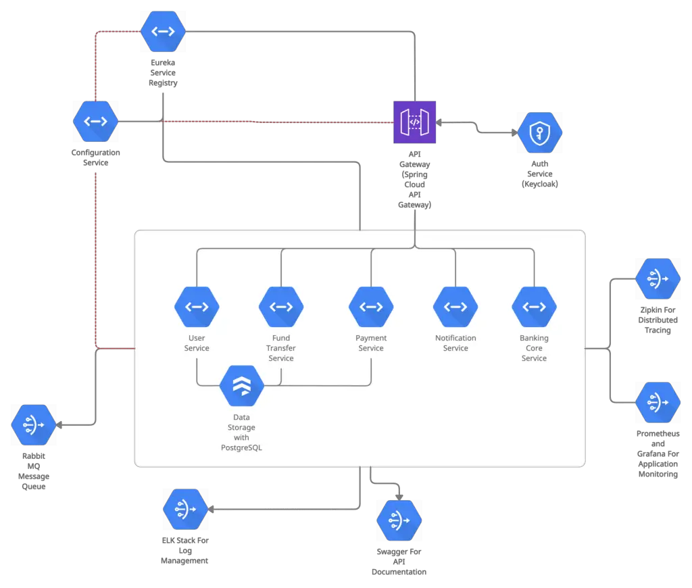

# Online Banking System Architecture for Citizens Bank



## 1. features / functionalities / system purpose + overview

#### Technologies Used

- **Backend**: Java, Spring Boot, Spring Cloud
- **Databases**: MySQL, Redis
- **Messaging**: RabbitMQ
- **Containerization**: Docker
- **Orchestration**: Kubernetes (AWS EKS)
- **Cloud Services**: AWS (EKS, RDS)
- **Monitoring**: Prometheus
- **Tracing**: Zipkin, Spring Cloud Sleuth
- **Client Communication**: OpenFeign
- **Development Methodology**: Agile

### Components Design

### User Service

- **Responsibilities**: User registration, authentication, profile management.
- **Technologies**: Java, Spring Boot, Spring Security, MySQL, Redis.
- **Endpoints**:
  - `/api/users/register`
  - `/api/users/login`
  - `/api/users/profile`
- **Security**: OAuth2, JWT for token-based authentication.

#### Components:

- **Controller**: REST endpoints for user management and authentication.
- **Service**: Business logic for user operations.
- **Repository**: Interface for MySQL operations.
- **Cache**: Redis for session and user data caching.

#### Database

- **MySQL Database:**
  - Stores:
    - User details: username, hashed password, email, first name, last name, phone number, address.
    - User profiles: profile picture, bio.
  - Used for:
    - User registration and authentication.
    - Profile management and updates.
- **Redis Cache:**
  - Stores:
    - Session data for authenticated users.
    - Cached user data for frequently accessed information.
  - Used for:
    - Efficient session management and quick retrieval of user data to enhance performance.

### Fund Transfer Service

- **Responsibilities**: Secure and efficient transfer of funds between accounts.
- **Technologies**: Java, Spring Boot, RabbitMQ, MySQL.
- **Endpoints**:
  - `/api/transfers`
- **Messaging**: Uses RabbitMQ for asynchronous processing.

#### Components:

- **Controller**: REST endpoints for fund transfers.
- **Service**: Business logic for fund transfer operations.
- **Repository**: Interface for MySQL operations.
- **Messaging**: RabbitMQ for asynchronous processing.

#### Database

- **MySQL Database:**
  - Stores:
    - Transfer details: source account ID, destination account ID, amount, status, timestamps.
  - Used for:
    - Persistent storage of fund transfer transactions.
    - Ensuring transaction integrity and history.

### Payment Service

- **Responsibilities**: Handling utility payments and processing.
- **Technologies**: Java, Spring Boot, RabbitMQ, MySQL.
- **Endpoints**:
  - `/api/payments`
- **Messaging**: Uses RabbitMQ for processing payments and sending notifications.

#### Components:

- **Controller**: REST endpoints for payment processing.
- **Service**: Business logic for payment operations.
- **Repository**: Interface for MySQL operations.
- **Messaging**: RabbitMQ for asynchronous processing.

#### Database

- **MySQL Database:**
  - Stores:
    - Payment details: account ID, amount, utility provider, status, timestamps.
  - Used for:
    - Storing payment transaction records.
    - Tracking payment statuses and history.

### Notification Service

- **Responsibilities**: Delivering notifications to users.
- **Technologies**: Java, Spring Boot, RabbitMQ.
- **Endpoints**:
  - `/api/notifications`
- **Messaging**: Uses RabbitMQ for efficient message consumption and delivery.

#### Components:

- **Controller**: REST endpoints for notifications.
- **Service**: Business logic for notification delivery.
- **Messaging**: RabbitMQ for asynchronous processing.

### Banking Core Service

- **Responsibilities**: Core banking functionalities like account management and transaction processing.
- **Technologies**: Java, Spring Boot, MySQL.
- **Endpoints**:
  - `/api/accounts`
  - `/api/transactions`
- **Data Management**: Integration with MySQL for transaction data storage.

#### Components:

- **Controller**: REST endpoints for account and transaction management.
- **Service**: Business logic for core banking operations.
- **Repository**: Interface for MySQL operations.

#### Database

- **MySQL Database:**
  - Stores:
    - Account details: account ID, user ID, account type, balance, timestamps.
    - Transaction details: transaction ID, account ID, amount, transaction type, timestamps.
  - Used for:
    - Managing and storing account information.
    - Recording transaction history and processing.

### Configuration Management

- **Technologies**: Spring Cloud Config Server.
- **Configuration Storage**: Git repository.

## 2. database schema (tables)

#### User Service

##### Users Table

- **Purpose**: Stores information about bank users.

| Column Name   | Data Type    | Description                    |
| ------------- | ------------ | ------------------------------ |
| user_id       | INT          | Primary key, auto-generated    |
| username      | VARCHAR(50)  | Unique username for login      |
| password_hash | VARCHAR(255) | Hashed password                |
| email         | VARCHAR(100) | Email address                  |
| first_name    | VARCHAR(50)  | First name                     |
| last_name     | VARCHAR(50)  | Last name                      |
| date_of_birth | DATE         | Date of birth                  |
| phone_number  | VARCHAR(20)  | Phone number                   |
| address       | VARCHAR(255) | Address                        |
| created_at    | TIMESTAMP    | Date and time of user creation |
| updated_at    | TIMESTAMP    | Date and time of last update   |

##### UserProfiles Table

- **Purpose**: Stores additional profile information for users.

| Column Name     | Data Type    | Description                           |
| --------------- | ------------ | ------------------------------------- |
| profile_id      | INT          | Primary key, auto-generated           |
| user_id         | INT          | Foreign key referencing Users table   |
| profile_picture | VARCHAR(255) | URL or path to user's profile picture |
| bio             | TEXT         | User biography                        |
| created_at      | TIMESTAMP    | Date and time of profile creation     |
| updated_at      | TIMESTAMP    | Date and time of last update          |

##### UserContacts Table

- **Purpose**: Stores contact information for users.

| Column Name  | Data Type    | Description                          |
| ------------ | ------------ | ------------------------------------ |
| contact_id   | INT          | Primary key, auto-generated          |
| user_id      | INT          | Foreign key referencing Users table  |
| contact_type | VARCHAR(20)  | Type of contact (e.g., email, phone) |
| contact_info | VARCHAR(100) | Contact information                  |

#### Fund Transfer Service

##### Transfers Table

- **Purpose**: Records details of fund transfers between accounts.

| Column Name         | Data Type      | Description                                       |
| ------------------- | -------------- | ------------------------------------------------- |
| transfer_id         | INT            | Primary key, auto-generated                       |
| sender_account_id   | INT            | Foreign key referencing Accounts table (sender)   |
| receiver_account_id | INT            | Foreign key referencing Accounts table (receiver) |
| amount              | DECIMAL(15, 2) | Amount of transfer                                |
| transfer_date       | TIMESTAMP      | Date and time of transfer                         |
| status              | VARCHAR(20)    | Status of transfer (e.g., pending, completed)     |
| description         | VARCHAR(255)   | Description of transfer (optional)                |

#### Payment Service

##### Payments Table

- **Purpose**: Stores information about utility payments and other payments.

| Column Name      | Data Type      | Description                            |
| ---------------- | -------------- | -------------------------------------- |
| payment_id       | INT            | Primary key, auto-generated            |
| account_id       | INT            | Foreign key referencing Accounts table |
| amount           | DECIMAL(15, 2) | Amount of payment                      |
| utility_provider | VARCHAR(100)   | Name of utility provider or payee      |
| payment_date     | TIMESTAMP      | Date and time of payment               |

##### PaymentMethods Table

- **Purpose**: Stores payment methods associated with accounts.

| Column Name       | Data Type    | Description                                              |
| ----------------- | ------------ | -------------------------------------------------------- |
| payment_method_id | INT          | Primary key, auto-generated                              |
| account_id        | INT          | Foreign key referencing Accounts table                   |
| method_type       | VARCHAR(50)  | Type of payment method (e.g., credit card, direct debit) |
| method_details    | VARCHAR(255) | Details of payment method                                |

#### Banking Core Service

##### Accounts Table

- **Purpose**: Stores information about bank accounts.

| Column Name    | Data Type      | Description                                     |
| -------------- | -------------- | ----------------------------------------------- |
| account_id     | INT            | Primary key, auto-generated                     |
| user_id        | INT            | Foreign key referencing Users table             |
| account_number | VARCHAR(20)    | Unique account number                           |
| account_type   | VARCHAR(50)    | Type of account (e.g., savings, checking)       |
| balance        | DECIMAL(15, 2) | Current balance                                 |
| currency       | VARCHAR(3)     | Currency code (e.g., USD, EUR)                  |
| opened_at      | TIMESTAMP      | Date and time account was opened                |
| closed_at      | TIMESTAMP      | Date and time account was closed (null if open) |

##### Transactions Table

- **Purpose**: Records all financial transactions between accounts.

| Column Name      | Data Type      | Description                                               |
| ---------------- | -------------- | --------------------------------------------------------- |
| transaction_id   | INT            | Primary key, auto-generated                               |
| account_id       | INT            | Foreign key referencing Accounts table                    |
| transaction_type | VARCHAR(20)    | Type of transaction (e.g., deposit, withdrawal, transfer) |
| amount           | DECIMAL(15, 2) | Amount of transaction                                     |
| description      | VARCHAR(255)   | Description of transaction (optional)                     |
| transaction_date | TIMESTAMP      | Date and time of transaction                              |

## 3. high level design (microservice architecture) and provide module pictures

### High-Level Architecture Diagram

```plaintext
                          +-------------------------+
                          |     User Interface      |
                          | +---------------------+ |
                          | | Web Application     | |
                          | | (React)             | |
                          | +---------------------+ |
                          +-----------+-------------+
                                      |
                                      v
                          +-------------------------+
                          |   API Gateway (Spring   |
                          |       Cloud Gateway)    |
                          +-----------+-------------+
                                      |
                                      v
        +-------------------+--------------------+------------------+-------------------+------------------+
        |                   |                    |                  |                   |                  |
        v                   v                    v                  v                   v                  v
+---------------+    +--------------+    +--------------+    +--------------+    +--------------+   +--------------+
|   User        |    | Fund Transfer|    | Payment      |    | Notification |    | Banking Core |   | Config Server|
|   Service     |    | Service      |    | Service      |    | Service      |    | Service      |   |              |
|   (Spring Boot|    | (Spring Boot|    | (Spring Boot  |    | (Spring Boot |    | (Spring Boot |   | (Spring Cloud|
|   + MySQL)    |    | + RabbitMQ)  |    | + RabbitMQ)  |    | + RabbitMQ)  |    | + MySQL)     |   | Config)      |
+---------------+    +--------------+    +--------------+    +--------------+    +--------------+   +--------------+
        |                   |                    |                  |                   |                  |
        v                   v                    v                  v                   v                  v
+---------------+    +--------------+    +--------------+    +--------------+    +--------------+   +--------------+
|  MySQL        |    | RabbitMQ     |    | RabbitMQ     |    | RabbitMQ     |    | MySQL        |   | Git Repo     |
|  (AWS RDS)    |    +--------------+    +--------------+    +--------------+    | (AWS RDS)    |   |              |
+---------------+                                                                +--------------+   +--------------+

                                      |
                                      v
                          +-------------------------+
                          |  Monitoring and Logging |
                          +-------------------------+
                          | +---------------------+ |
                          | | Prometheus          | |
                          | +---------------------+ |
                          | +---------------------+ |
                          | | Grafana             | |
                          | +---------------------+ |
                          | +---------------------+ |
                          | | ELK Stack           | |
                          | +---------------------+ |
                          | +---------------------+ |
                          | | Zipkin              | |
                          | +---------------------+ |
                          +-------------------------+

                                      |
                                      v
                          +-------------------------+
                          | Deployment and          |
                          | Orchestration           |
                          +-------------------------+
                          | +---------------------+ |
                          | | Docker              | |
                          | +---------------------+ |
                          | +---------------------+ |
                          | | Kubernetes (AWS EKS)| |
                          | +---------------------+ |
                          | +---------------------+ |
                          | | AWS Services        | |
                          | +---------------------+ |
                          +-------------------------+
```

## 4. rest api design (design 2 - 4 rest apis)

#### User Service

1. **Register a User**

   - **Endpoint**: POST `/api/users/register`
   - **Request Body**:
     ```json
     {
       "username": "john_doe",
       "password": "password123",
       "email": "john.doe@example.com",
       "firstName": "John",
       "lastName": "Doe",
       "dateOfBirth": "1990-01-01",
       "phoneNumber": "+1234567890",
       "address": "123 Main St, Anytown, USA"
     }
     ```
   - **Response**: HTTP 201 Created

2. **User Login**

   - **Endpoint**: POST `/api/users/login`
   - **Request Body**:
     ```json
     {
       "username": "john_doe",
       "password": "password123"
     }
     ```
   - **Response**: HTTP 200 OK with JWT token in response body

3. **Get User Profile**
   - **Endpoint**: GET `/api/users/profile`
   - **Headers**: Authorization: Bearer \<JWT Token>
   - **Response**:
     ```json
     {
       "userId": 123,
       "username": "john_doe",
       "email": "john.doe@example.com",
       "firstName": "John",
       "lastName": "Doe",
       "dateOfBirth": "1990-01-01",
       "phoneNumber": "+1234567890",
       "address": "123 Main St, Anytown, USA"
     }
     ```

#### Fund Transfer Service

4. **Initiate Fund Transfer**
   - **Endpoint**: POST `/api/transfers`
   - **Request Body**:
     ```json
     {
       "senderAccountId": 456,
       "receiverAccountId": 789,
       "amount": 100.0,
       "description": "Payment for services"
     }
     ```
   - **Headers**: Authorization: Bearer \<JWT Token>
   - **Response**: HTTP 200 OK with transfer details

#### Banking Core Service

5. **Get Account Details**
   - **Endpoint**: GET `/api/accounts/{accountId}`
   - **Headers**: Authorization: Bearer \<JWT Token>
   - **Response**:
     ```json
     {
       "accountId": 456,
       "userId": 123,
       "accountNumber": "ABC123",
       "accountType": "Savings",
       "balance": 5000.0,
       "currency": "USD",
       "openedAt": "2024-07-15T10:00:00Z",
       "closedAt": null
     }
     ```

#### Payment Service

6. **Initiate Utility Payment**

   - **Endpoint**: POST `/api/payments/utility`
   - **Description**: Initiates a utility bill payment for a specified account.
   - **Request Body**:
     ```json
     {
       "accountId": 456,
       "amount": 150.0,
       "utilityProvider": "XYZ Electric",
       "description": "Monthly electricity bill payment"
     }
     ```
   - **Headers**:
     - `Authorization`: Bearer \<JWT Token>
     - `Content-Type`: application/json
   - **Response**:
     - HTTP 200 OK
     - Example:
       ```json
       {
         "paymentId": 12345,
         "accountId": 456,
         "amount": 150.0,
         "paymentType": "Utility",
         "utilityProvider": "XYZ Electric",
         "paymentDate": "2024-07-15T12:00:00Z",
         "status": "Success"
       }
       ```

7. **Initiate Loan Payment**

   - **Endpoint**: POST `/api/payments/loan`
   - **Description**: Initiates a loan payment for a specified account.
   - **Request Body**:
     ```json
     {
       "accountId": 456,
       "loanId": 789,
       "amount": 500.0,
       "description": "Monthly loan installment payment"
     }
     ```
   - **Headers**:
     - `Authorization`: Bearer \<JWT Token>
     - `Content-Type`: application/json
   - **Response**:
     - HTTP 200 OK
     - Example:
       ```json
       {
         "paymentId": 12346,
         "accountId": 456,
         "amount": 500.0,
         "paymentType": "Loan",
         "loanId": 789,
         "paymentDate": "2024-07-15T12:00:00Z",
         "status": "Success"
       }
       ```

8. **Get Payment History**
   - **Endpoint**: GET `/api/payments/history`
   - **Description**: Retrieves the payment history for a specified account.
   - **Query Parameters**:
     - `accountId`: Integer (required) - The ID of the account for which to retrieve payment history.
     - `startDate`: Date (optional) - Start date of the range for payment history (format: YYYY-MM-DD).
     - `endDate`: Date (optional) - End date of the range for payment history (format: YYYY-MM-DD).
   - **Headers**:
     - `Authorization`: Bearer \<JWT Token>
   - **Response**:
     - HTTP 200 OK
     - Example:
       ```json
       [
         {
           "paymentId": 12345,
           "accountId": 456,
           "amount": 150.0,
           "paymentType": "Utility",
           "utilityProvider": "XYZ Electric",
           "paymentDate": "2024-07-15T12:00:00Z",
           "status": "Success"
         },
         {
           "paymentId": 12346,
           "accountId": 456,
           "amount": 500.0,
           "paymentType": "Loan",
           "loanId": 789,
           "paymentDate": "2024-07-15T12:00:00Z",
           "status": "Success"
         }
       ]
       ```

## 5.Data flow, prepare 2 - 3 data flow diagram (example: when user client some buttons to upload some files, what happens next, how does request go through your services)

Certainly! Here are a few data flow diagrams for different scenarios in an online banking system, illustrating how requests flow through various services:

### Data Flow Diagrams for Online Banking System

Bank Payment Service
Purpose: Facilitates the processing of payments for various transactions.
Key Functions:
**Transaction Processing:** Manages payment transactions between customers and merchants.
**Payment Gateway Integration:** Interfaces with third-party payment gateways to process credit/debit card transactions.
**Fraud Detection:** Implements mechanisms to detect and prevent fraudulent activities.
**Settlement and Reconciliation:** Ensures accurate settlement of funds between different parties and reconciles transactions to maintain financial accuracy.

Fund Transfer Service
Purpose: Allows for the transfer of funds between different accounts within the same or different financial institutions.
Key Functions:
**Account-to-Account Transfers:** Enables transfers between accounts held by the same user or different users within the same bank.
**Interbank Transfers:** Facilitates transfers between accounts held at different banks, often using systems like ACH (Automated Clearing House) or wire transfers.
**Scheduled Transfers:** Allows users to schedule future transfers, either as one-time or recurring transactions.
**Transfer Notifications:** Notifies users of successful transfers and any issues that may arise during the process.

#### Scenario 1: User Initiates Fund Transfer

1. **Data Flow Diagram: User Initiates Fund Transfer**

   **Description**: This diagram illustrates the flow when a user initiates a fund transfer between accounts.

   - **User Client**: Initiates a fund transfer request through the frontend application.
   - **API Gateway**: Receives the request and routes it to the Fund Transfer Service.
   - **Fund Transfer Service**: Processes the request, verifies user credentials, and performs the necessary validations.
   - **Accounts Service**: Handles account-related operations, such as deducting funds from the sender's account and crediting them to the receiver's account.
   - **Database**: Stores transaction details and updates account balances.
   - **Response**: The response flows back through the services to the user client, confirming the success or failure of the fund transfer operation.

#### Scenario 2: User Checks Account Balance

2. **Data Flow Diagram: User Checks Account Balance**

   **Description**: This diagram illustrates the flow when a user checks their account balance.

   - **User Client**: Sends a request to retrieve account balance information.
   - **API Gateway**: Routes the request to the Accounts Service.
   - **Accounts Service**: Fetches account details from the database based on the user's request.
   - **Database**: Retrieves account information from the Accounts table.
   - **Response**: Sends the account balance information back through the services to the user client, displaying it on the frontend application.

#### Scenario 3: User Makes a Payment

3. **Data Flow Diagram: User Makes a Payment**

   **Description**: This diagram illustrates the flow when a user initiates a payment transaction.

   - **User Client**: Initiates a payment request, specifying payment details (e.g., amount, recipient).
   - **API Gateway**: Directs the request to the Payment Service.
   - **Payment Service**: Validates the payment details, checks account balances, and processes the payment transaction.
   - **Accounts Service**: Updates account balances after successful payment processing.
   - **Database**: Stores payment transaction details and updates account balances.
   - **Response**: Sends the payment confirmation back through the services to the user client, displaying the transaction status.

## 6. message queue

Designing a message queue for an online banking system involves ensuring reliable communication between services, particularly for tasks that can be processed asynchronously. Here's how you can design a message queue using RabbitMQ for the key services in the banking system:

### Message Queue Design for Online Banking System

#### Key Components:

1. **Message Broker**: RabbitMQ
2. **Services**:
   - User Service
   - Fund Transfer Service
   - Payment Service
   - Notification Service
   - Audit/Logging Service

### Use Cases for Message Queue:

1. **Fund Transfer Processing**:
   - When a user initiates a fund transfer, the request is placed on a queue for processing.
2. **Payment Processing**:
   - Payments, such as utility bills or loan repayments, are placed on a queue for processing.
3. **Notification Delivery**:
   - Notifications for successful transactions, balance updates, etc., are sent to the Notification Service via a queue.
4. **Audit Logging**:
   - Every transaction and significant action is logged via a queue for auditing purposes.

### Message Queue Design:

1. **Fund Transfer Queue**:

   - **Queue Name**: `fund_transfer_queue`
   - **Exchange**: `fund_transfer_exchange`
   - **Routing Key**: `fund_transfer_routing_key`
   - **Consumers**: Fund Transfer Service

2. **Payment Queue**:

   - **Queue Name**: `payment_queue`
   - **Exchange**: `payment_exchange`
   - **Routing Key**: `payment_routing_key`
   - **Consumers**: Payment Service

3. **Notification Queue**:

   - **Queue Name**: `notification_queue`
   - **Exchange**: `notification_exchange`
   - **Routing Key**: `notification_routing_key`
   - **Consumers**: Notification Service

4. **Audit Queue**:
   - **Queue Name**: `audit_queue`
   - **Exchange**: `audit_exchange`
   - **Routing Key**: `audit_routing_key`
   - **Consumers**: Audit/Logging Service

### Message Queue Workflow:

#### Fund Transfer Workflow:

1. **User Client**: Initiates a fund transfer.
2. **API Gateway**: Routes the request to the Fund Transfer Service.
3. **Fund Transfer Service**: Publishes a message to the `fund_transfer_queue`.
4. **Queue**: `fund_transfer_queue`
5. **Consumer**: Fund Transfer Service processes the message, performs the transfer, updates account balances, and publishes a notification message to the `notification_queue`.

#### Payment Workflow:

1. **User Client**: Initiates a payment.
2. **API Gateway**: Routes the request to the Payment Service.
3. **Payment Service**: Publishes a message to the `payment_queue`.
4. **Queue**: `payment_queue`
5. **Consumer**: Payment Service processes the message, updates account balances, interacts with external services (if needed), and publishes a notification message to the `notification_queue`.

#### Notification Workflow:

1. **Service**: Publishes a notification message to the `notification_queue`.
2. **Queue**: `notification_queue`
3. **Consumer**: Notification Service processes the message and sends the notification to the user via email, SMS, or in-app notification.

#### Audit Logging Workflow:

1. **Any Service**: Publishes an audit log message to the `audit_queue`.
2. **Queue**: `audit_queue`
3. **Consumer**: Audit/Logging Service processes the message and writes the log entry to the database or log files for auditing purposes.

### Example Queue Configuration:

**RabbitMQ Configuration**:

1. **Exchanges**:

   ```yaml
   exchanges:
     - name: fund_transfer_exchange
       type: direct
     - name: payment_exchange
       type: direct
     - name: notification_exchange
       type: direct
     - name: audit_exchange
       type: direct
   ```

2. **Queues**:

   ```yaml
   queues:
     - name: fund_transfer_queue
       durable: true
     - name: payment_queue
       durable: true
     - name: notification_queue
       durable: true
     - name: audit_queue
       durable: true
   ```

3. **Bindings**:
   ```yaml
   bindings:
     - exchange: fund_transfer_exchange
       queue: fund_transfer_queue
       routing_key: fund_transfer_routing_key
     - exchange: payment_exchange
       queue: payment_queue
       routing_key: payment_routing_key
     - exchange: notification_exchange
       queue: notification_queue
       routing_key: notification_routing_key
     - exchange: audit_exchange
       queue: audit_queue
       routing_key: audit_routing_key
   ```

## 7. biggest challenge(technical challenge)

In my previous role, I worked on designing and implementing an online banking system for Citizens Bank. One of the biggest technical challenges we faced was handling high transaction volumes and concurrent user requests efficiently, particularly during peak times such as salary disbursements or during periods of market volatility.

**Challenge**:
The main challenge was to ensure that the system could scale dynamically to handle varying loads and maintain low latency in transaction processing and real-time data access. This was crucial to providing a seamless user experience and maintaining the integrity of financial transactions.

**Details**:

1. **Load Balancing**: We needed to efficiently distribute incoming requests across multiple instances of our microservices to prevent any single instance from becoming a bottleneck.
2. **Auto-scaling**: It was essential to dynamically scale our infrastructure to handle sudden spikes in traffic, ensuring that the system remained responsive and performant.
3. **Latency**: Minimizing latency was critical for real-time operations, such as balance inquiries and fund transfers, to meet user expectations and maintain transaction integrity.

**Solution**:
To address these challenges, we implemented the following strategies:

1. **Kubernetes for Container Orchestration and Auto-scaling**:

   - We used Kubernetes to orchestrate our microservices, which allowed us to deploy, manage, and scale our applications efficiently.
   - Kubernetes' auto-scaling capabilities enabled us to automatically adjust the number of running instances based on current load, ensuring that we had enough resources to handle peak traffic without over-provisioning during off-peak times.

2. **Horizontal Scaling for Microservices**:

   - We designed our microservices to be stateless, enabling them to be horizontally scalable. This meant we could easily add more instances to handle increased load.
   - Each microservice was deployed as a Docker container, managed by Kubernetes, which made it simple to scale out by adding more containers as needed.

3. **Optimizing Database Queries and Indexing**:

   - We optimized our database queries to ensure they were efficient and could handle large volumes of transactions. This involved writing efficient SQL queries, using proper indexing strategies, and periodically reviewing and optimizing database performance.
   - For frequently accessed data, we utilized read replicas to distribute the load and reduce latency.

4. **Caching Mechanisms with Redis**:

   - We implemented Redis for caching frequently accessed data, such as user session information and account balances. This reduced the load on our databases and significantly improved response times for repeated requests.
   - By caching critical data, we could serve many requests directly from the cache, minimizing the need to query the database and thus reducing latency.

5. **Load Balancing**:
   - We used a combination of hardware and software load balancers to distribute incoming traffic across multiple instances of our services. This ensured that no single instance was overwhelmed with too many requests.
   - Implementing round-robin and least-connection strategies allowed us to balance the load effectively and maintain high availability.

**Outcome**:
These measures collectively ensured that our system could handle high transaction volumes and concurrent user requests efficiently, even during peak times. By leveraging Kubernetes for orchestration and auto-scaling, optimizing our database interactions, and using Redis for caching, we were able to provide a responsive and reliable online banking experience for our users.

## 8. aws

Deploying an enterprise-level online banking system like the one described can leverage various AWS services to ensure scalability, reliability, security, and performance. Here’s how you can deploy the system using AWS services:

### AWS Services for Deployment

#### 1. **Amazon EKS (Elastic Kubernetes Service)**

- **Purpose**: Orchestrate and manage Docker containers.
- **Details**: Use EKS to deploy, manage, and scale your Kubernetes clusters. EKS simplifies running Kubernetes on AWS without needing to install and operate your own Kubernetes control plane or nodes.

#### 2. **Amazon RDS (Relational Database Service)**

- **Purpose**: Managed relational databases.
- **Details**: Use Amazon RDS for MySQL to manage relational databases with ease. RDS automates time-consuming administration tasks like hardware provisioning, database setup, patching, and backups.

#### 3. **Amazon DynamoDB**

- **Purpose**: NoSQL database service.
- **Details**: Use DynamoDB for storing unstructured data or for services requiring high throughput and low latency. It’s fully managed, scalable, and provides fast and predictable performance.

#### 4. **Amazon S3 (Simple Storage Service)**

- **Purpose**: Object storage.
- **Details**: Use S3 to store and retrieve any amount of data at any time. It’s ideal for storing backup data, logs, and other files.

#### 5. **Amazon ElastiCache**

- **Purpose**: In-memory data store and cache.
- **Details**: Use ElastiCache for Redis to deploy, operate, and scale an in-memory data store and cache in the cloud, improving the performance of web applications by allowing you to retrieve information from fast, managed, in-memory caches.

#### 6. **Amazon MQ**

- **Purpose**: Managed message broker service.
- **Details**: Use Amazon MQ to set up and operate message brokers in the cloud. This is suitable for RabbitMQ, ensuring reliable communication between microservices.

#### 7. **AWS Lambda**

- **Purpose**: Serverless computing.
- **Details**: Use Lambda for executing code in response to events such as changes to data in an Amazon S3 bucket or an update to a DynamoDB table.

#### 8. **Amazon CloudWatch**

- **Purpose**: Monitoring and observability.
- **Details**: Use CloudWatch to monitor AWS cloud resources and applications. It provides data and actionable insights to monitor your applications, understand and respond to system-wide performance changes, and optimize resource utilization.

#### 9. **AWS IAM (Identity and Access Management)**

- **Purpose**: Secure control of services and resources.
- **Details**: Use IAM to manage access to AWS services and resources securely. Create and manage AWS users and groups and use permissions to allow and deny their access to AWS resources.

#### 10. **Amazon CloudFront**

- **Purpose**: Content Delivery Network (CDN).
- **Details**: Use CloudFront to deliver your content with low latency and high transfer speeds. It's ideal for distributing static and dynamic web content.

### Example Deployment Architecture

Here’s how you can structure the deployment architecture using these AWS services:

1. **User Service**:

   - **Database**: Amazon RDS for MySQL (for structured user data)
   - **Cache**: Amazon ElastiCache (for session management and frequently accessed user data)
   - **Deployment**: Amazon EKS (Kubernetes cluster)
   - **API Gateway**: Amazon API Gateway (for managing API endpoints)
   - **Authentication**: AWS IAM (for secure access management)

2. **Fund Transfer Service**:

   - **Messaging**: Amazon MQ (for RabbitMQ messaging)
   - **Database**: Amazon RDS for MySQL (for transaction records)
   - **Deployment**: Amazon EKS (Kubernetes cluster)

3. **Payment Service**:

   - **Messaging**: Amazon MQ (for RabbitMQ messaging)
   - **Database**: Amazon DynamoDB (for payment records)
   - **Deployment**: Amazon EKS (Kubernetes cluster)
   - **Notification**: AWS Lambda (for triggering notifications on payment events)

4. **Notification Service**:

   - **Messaging**: Amazon MQ (for RabbitMQ messaging)
   - **Deployment**: Amazon EKS (Kubernetes cluster)
   - **Notification Delivery**: Amazon SNS (Simple Notification Service) for sending out notifications to users

5. **Banking Core Service**:

   - **Database**: Amazon RDS for MySQL (for core banking data)
   - **Cache**: Amazon ElastiCache (for caching core banking data)
   - **Deployment**: Amazon EKS (Kubernetes cluster)

6. **Configuration Management**:
   - **Service**: AWS Systems Manager Parameter Store (for configuration management)
   - **Secrets**: AWS Secrets Manager (for managing sensitive configuration data)

### Monitoring and Logging

- **Amazon CloudWatch**: For monitoring the performance and health of the deployed services.
- **AWS CloudTrail**: For auditing and logging user activity and API usage.
- **Elasticsearch Service**: For centralized logging and real-time analysis of log data.

### Security

- **AWS IAM**: For defining roles and permissions to access different services.
- **AWS KMS (Key Management Service)**: For managing encryption keys.

### Content Delivery

- **Amazon CloudFront**: For serving static content (e.g., web app assets) with low latency.

## 9.Prepare stories based on your resume: example, where did you use multithreading in your last project? Where did you use builder design patterns in your last project?

Here are some stories based on your resume that illustrate your experience with multithreading and the Builder design pattern:

### Story 1: Using Multithreading at Citizens Bank

**Question**: Where did you use multithreading in your last project?

**Answer**:

In my role at Citizens Bank, I worked on developing a microservices-based online banking platform. One of the key challenges we faced was ensuring that the system could handle a high volume of concurrent transactions, especially during peak times like salary disbursements.

**Scenario**: We needed to process a large number of secure fund transfers between accounts simultaneously without causing delays or overloading the system.

**Solution**:
To address this, I implemented multithreading in the Fund Transfer Service. Here’s how:

1. **Concurrent Processing of Fund Transfers**:

   - I used the Java `ExecutorService` to manage a pool of threads that handled fund transfer requests concurrently. This allowed us to process multiple transfers in parallel, significantly reducing the overall processing time.

2. **Asynchronous Messaging with RabbitMQ**:

   - We integrated RabbitMQ to handle the queuing of fund transfer requests. Each message in the queue represented a transfer request, which was processed by a separate thread from the thread pool. This decoupling ensured that the main application thread remained responsive, and we could scale the number of worker threads based on the system load.

3. **Ensuring Data Consistency and Integrity**:
   - Implementing multithreading introduced potential risks of data inconsistency. To mitigate this, I used synchronized blocks and locks where necessary to ensure that account balances were updated atomically. Additionally, I employed optimistic locking mechanisms using versioning in our MySQL database to handle concurrent updates safely.

**Outcome**:
The use of multithreading enabled us to handle high transaction volumes efficiently, maintaining system performance and ensuring timely processing of fund transfers even during peak periods.

---

### Story 2: Implementing the Builder Design Pattern at Citizens Bank

**Question**: Where did you use the Builder design pattern in your last project?

**Answer**:

In my role at Citizens Bank, I worked on developing a microservices-based online banking platform. One of the key features we developed was the fund transfer functionality, which involved creating complex transfer requests with multiple optional parameters.

**Scenario**: We needed to construct complex transfer request objects that could include various optional attributes such as transfer notes, scheduled dates, recurring transfer options, and multi-currency support. The traditional way of creating these objects made the codebase cumbersome and difficult to maintain.

**Solution**:
I utilized the Builder design pattern to simplify the creation of these complex transfer request objects. Here’s how:

1. **Complex Transfer Request Construction**:

   - Transfer requests in our system could have numerous optional fields. Using the Builder pattern allowed us to construct these objects in a readable and manageable way.

2. **Implementing the Builder**:

   - I created a `TransferRequestBuilder` class that provided a fluent interface for setting optional attributes. Each method in the builder returned the builder instance, enabling method chaining. The final `build()` method constructed the immutable `TransferRequest` object.

3. **Improving Code Maintainability and Readability**:

   - The Builder pattern helped in segregating the complex construction logic from the `TransferRequest` class, adhering to the single responsibility principle. It also made the code more readable and easier to understand, as the creation of a transfer request object was now clear and concise.

4. **Handling Validation and Default Values**:
   - The builder also incorporated validation logic and default values for certain fields, ensuring that only valid transfer requests were created and reducing the likelihood of runtime errors.

**Example**:

```java
TransferRequest transferRequest = new TransferRequestBuilder()
                                     .withSourceAccount("123456789")
                                     .withDestinationAccount("987654321")
                                     .withAmount(500.00)
                                     .withCurrency("USD")
                                     .withTransferNote("Rent payment")
                                     .withScheduledDate(LocalDate.now().plusDays(1))
                                     .build();
```

**Outcome**:
Using the Builder design pattern resulted in more maintainable and robust code. It allowed our team to easily add new optional attributes to the `TransferRequest` class without affecting existing functionality, facilitating smoother feature expansions and maintenance.

---

## 10. Come up team size(if you are the leader, how many people do you need and their responsibilities)

To successfully implement and maintain the enterprise-level online banking system for Citizens Bank, a well-structured and skilled team is essential. Here’s a proposed team structure along with their responsibilities:

### Team Size and Structure

1. **Project Manager (1)**

   - **Responsibilities**: Overall project planning, resource allocation, timeline management, risk management, stakeholder communication, and ensuring project milestones are met.

2. **Technical Lead (1)**

   - **Responsibilities**: Overseeing technical aspects of the project, making high-level design decisions, ensuring adherence to architectural standards, code reviews, and mentoring developers.

3. **Backend Developers (4)**

   - **Responsibilities**: Developing microservices, implementing business logic, integrating databases, writing APIs, implementing multithreading and concurrency controls, ensuring security measures are in place.
   - **Technologies**: Java, Spring Boot, Spring Cloud, MySQL, Redis, RabbitMQ.

4. **Frontend Developers (2)**

   - **Responsibilities**: Developing user interfaces, ensuring responsive design, integrating with backend services, optimizing performance.
   - **Technologies**: Angular, HTML, CSS, TypeScript, NgRx.

5. **DevOps Engineers (2)**

   - **Responsibilities**: Setting up CI/CD pipelines, managing infrastructure as code, ensuring system scalability and reliability, monitoring and logging, handling deployments.
   - **Technologies**: Docker, Kubernetes, AWS (EKS, RDS, S3, CloudWatch), Jenkins, Terraform.

6. **Database Administrators (2)**

   - **Responsibilities**: Designing and managing databases, ensuring data integrity and security, optimizing queries, managing backups and recovery.
   - **Technologies**: MySQL, Redis, DynamoDB.

7. **QA Engineers (3)**

   - **Responsibilities**: Developing and executing test plans, writing automated tests, performing manual testing, ensuring product quality, managing bug tracking.
   - **Technologies**: JUnit, Selenium, Postman, Jenkins.

8. **Security Specialist (1)**

   - **Responsibilities**: Ensuring the security of the application, conducting security audits, implementing security protocols, managing encryption, ensuring compliance with regulations.
   - **Technologies**: OAuth2, JWT, SSL/TLS, AWS IAM, AWS KMS.

9. **Business Analyst (1)**

   - **Responsibilities**: Gathering and analyzing business requirements, acting as a liaison between stakeholders and the development team, ensuring the product meets business needs.

10. **UI/UX Designer (1)**

    - **Responsibilities**: Designing user interfaces, creating wireframes and mockups, ensuring a seamless user experience, conducting usability testing.

11. **Support Engineers (2)**
    - **Responsibilities**: Providing technical support, troubleshooting issues, managing customer queries, ensuring smooth operation post-deployment.

### Team Size Summary

- **Total Team Size**: 20 Members

## 11. Design a Jenkins pipeline flow to (AWS / local) depends on your resume project(if you want to keep AWS)

Sure, based on your extensive experience with AWS and Jenkins, here's a detailed Jenkins pipeline flow designed for deploying an online banking system to AWS. This pipeline will include stages for building, testing, and deploying the application using AWS services.

### Jenkins Pipeline Flow

#### Prerequisites:

- Jenkins server with necessary plugins installed (e.g., AWS, Docker, Kubernetes, Git, etc.)
- AWS account with IAM roles configured for Jenkins
- Docker and Kubernetes setup for containerization and orchestration
- Source code repository (e.g., GitHub)

### Jenkinsfile (Declarative Pipeline)

```groovy
pipeline {
    agent any

    environment {
        AWS_CREDENTIALS = credentials('aws-credentials-id')
        DOCKER_IMAGE = "citizens-bank/banking-app:${env.BUILD_NUMBER}"
        KUBECONFIG_CREDENTIALS = credentials('kubeconfig-credentials-id')
    }

    stages {
        stage('Checkout') {
            steps {
                git 'https://github.com/your-repo/citizens-bank.git'
            }
        }

        stage('Build') {
            steps {
                script {
                    def mvnHome = tool 'Maven 3.6.3'
                    sh "${mvnHome}/bin/mvn clean install"
                }
            }
        }

        stage('Test') {
            steps {
                script {
                    def mvnHome = tool 'Maven 3.6.3'
                    sh "${mvnHome}/bin/mvn test"
                }
            }
        }

        stage('Docker Build and Push') {
            steps {
                script {
                    docker.build(DOCKER_IMAGE).push()
                }
            }
        }

        stage('Deploy to Kubernetes') {
            steps {
                script {
                    withCredentials([string(credentialsId: 'kubeconfig', variable: 'KUBECONFIG_CONTENT')]) {
                        writeFile file: 'kubeconfig', text: KUBECONFIG_CONTENT
                        sh 'kubectl --kubeconfig=kubeconfig apply -f k8s/deployment.yaml'
                    }
                }
            }
        }

        stage('Deploy to AWS EKS') {
            steps {
                script {
                    withCredentials([string(credentialsId: 'aws-eks-cluster-name', variable: 'CLUSTER_NAME')]) {
                        sh """
                        aws eks update-kubeconfig --region us-west-2 --name ${CLUSTER_NAME} --kubeconfig kubeconfig
                        kubectl apply -f k8s/aws-deployment.yaml --kubeconfig kubeconfig
                        """
                    }
                }
            }
        }

        stage('Notify') {
            steps {
                mail to: 'team@example.com',
                     subject: "Deployment Pipeline: ${currentBuild.fullDisplayName}",
                     body: "The pipeline has ${currentBuild.currentResult}. Check Jenkins for details."
            }
        }
    }

    post {
        always {
            cleanWs()
        }
    }
}
```

### Detailed Breakdown of the Pipeline Flow:

#### 1. **Checkout Stage:**

- Pulls the latest code from the Git repository.

#### 2. **Build Stage:**

- Uses Maven to clean and build the project, compiling the code and packaging it into an artifact (e.g., JAR file).

#### 3. **Test Stage:**

- Runs unit tests using Maven to ensure code quality and functionality.

#### 4. **Docker Build and Push Stage:**

- Builds a Docker image for the application using the latest build artifacts.
- Tags the Docker image with the build number for versioning.
- Pushes the Docker image to a Docker registry (e.g., Docker Hub or AWS ECR).

#### 5. **Deploy to Kubernetes Stage:**

- Uses `kubectl` to apply Kubernetes deployment configurations, deploying the application to a Kubernetes cluster (local or another non-AWS environment).
- Uses credentials stored in Jenkins to authenticate with the Kubernetes cluster.

#### 6. **Deploy to AWS EKS Stage:**

- Updates the kubeconfig to authenticate with the AWS EKS cluster.
- Deploys the application to the AWS EKS cluster using Kubernetes deployment configurations.
- Uses AWS CLI commands to interact with the EKS cluster.

#### 7. **Notify Stage:**

- Sends an email notification to the team with the result of the pipeline execution.

### Kubernetes Deployment Configuration (k8s/aws-deployment.yaml)

```yaml
apiVersion: apps/v1
kind: Deployment
metadata:
  name: banking-app
  labels:
    app: banking-app
spec:
  replicas: 3
  selector:
    matchLabels:
      app: banking-app
  template:
    metadata:
      labels:
        app: banking-app
    spec:
      containers:
        - name: banking-app
          image: citizens-bank/banking-app:latest
          ports:
            - containerPort: 8080
          env:
            - name: SPRING_PROFILES_ACTIVE
              value: aws
```

### AWS Services Used:

1. **AWS EKS (Elastic Kubernetes Service)**:

   - Manages Kubernetes clusters, simplifying the orchestration and scaling of containerized applications.

2. **AWS ECR (Elastic Container Registry)**:

   - Stores, manages, and deploys Docker container images.

3. **AWS IAM (Identity and Access Management)**:

   - Manages access to AWS services and resources securely.

4. **AWS S3 (Simple Storage Service)**:

   - Stores build artifacts, logs, and other static content if needed.

5. **AWS CloudWatch**:
   - Monitors and logs application performance and infrastructure metrics.

## 12. monitor in project

Monitoring is a crucial aspect of maintaining the health, performance, and security of an enterprise-level online banking system. For this project, monitoring will be implemented using various tools and AWS services to provide real-time insights and alerts.

### Monitoring Strategy for Online Banking System

#### 1. **Infrastructure Monitoring with AWS CloudWatch**

- **AWS CloudWatch**: Monitor AWS resources and applications running on AWS. Collect and track metrics, collect and monitor log files, set alarms, and automatically react to changes in AWS resources.
  - **Metrics**: Monitor CPU utilization, memory usage, disk I/O, network traffic, and other performance metrics of EC2 instances, EKS nodes, and other AWS services.
  - **Logs**: Collect and analyze logs from EC2 instances, Lambda functions, and other AWS services. Create custom log metrics based on log data.
  - **Alarms**: Set up CloudWatch alarms to notify the team when certain thresholds are breached, such as high CPU usage or low available memory.

#### 2. **Centralized Logging with ELK Stack (Elasticsearch, Logstash, Kibana)**

- **Elasticsearch**: Store and search log data for faster retrieval and analysis.
- **Logstash**: Collect, parse, and enrich logs from various sources and send them to Elasticsearch.
- **Kibana**: Visualize log data with customizable dashboards to gain insights into system and application logs.
  - **Log Collection**: Use Logstash to collect logs from applications, Docker containers, and Kubernetes pods.
  - **Dashboards**: Create dashboards in Kibana to monitor key metrics such as error rates, request latencies, and application performance.

#### 3. **Real-time Monitoring with Prometheus and Grafana**

- **Prometheus**: Collect and store metrics from applications and infrastructure.
  - **Metric Collection**: Use Prometheus exporters to collect metrics from microservices, Kubernetes nodes, and custom applications.
  - **Alerting**: Set up alerting rules in Prometheus to trigger notifications based on specific conditions.
- **Grafana**: Visualize metrics collected by Prometheus.
  - **Dashboards**: Create and share dynamic dashboards in Grafana to monitor application performance, resource usage, and custom metrics.

#### 4. **Security Monitoring with AWS Security Hub and GuardDuty**

- **AWS Security Hub**: Centralize and prioritize security findings from multiple AWS services.
  - **Security Best Practices**: Continuously monitor AWS accounts for security compliance.
- **AWS GuardDuty**: Detect suspicious activity and threats using machine learning and anomaly detection.
  - **Threat Detection**: Monitor AWS accounts, workloads, and data stored in S3 for potential security threats.

### Example Implementation

#### 1. **Infrastructure Monitoring with AWS CloudWatch**

```yaml
# AWS CloudWatch Alarm for High CPU Usage
resource "aws_cloudwatch_metric_alarm" "high_cpu_usage" {
alarm_name                = "HighCPUUsage"
comparison_operator       = "GreaterThanOrEqualToThreshold"
evaluation_periods        = "2"
metric_name               = "CPUUtilization"
namespace                 = "AWS/EC2"
period                    = "60"
statistic                 = "Average"
threshold                 = "80"
alarm_description         = "This metric monitors EC2 CPU utilization"
alarm_actions             = ["arn:aws:sns:us-west-2:123456789012:NotifyMe"]
dimensions = {
InstanceId = "i-1234567890abcdef0"
}
}
```

#### 2. **Centralized Logging with ELK Stack**

```yaml
# Logstash configuration to collect Docker container logs
input {
file {
path => "/var/lib/docker/containers/*/*.log"
type => "docker"
}
}
filter {
json {
source => "message"
}
}
output {
elasticsearch {
hosts => ["http://localhost:9200"]
index => "docker-logs-%{+YYYY.MM.dd}"
}
}
```

#### 3. **Real-time Monitoring with Prometheus and Grafana**

```yaml
# Prometheus configuration to scrape metrics from a Spring Boot application
scrape_configs:
  - job_name: "spring-boot"
    static_configs:
      - targets: ["localhost:8080"]
```

#### 4. **Security Monitoring with AWS Security Hub and GuardDuty**

```yaml
# Enable AWS GuardDuty
resource "aws_guardduty_detector" "main" {
enable = true
}
```

## 13. daily user / TPS / QPS

### Daily User Activity

- **Active Users**: Citizens Bank serves a diverse customer base, including individual consumers, small businesses, and corporate clients. Daily active users could range from **hundreds of thousands** to **millions**, depending on the market reach and digital adoption.
- **Typical Actions**: Users engage in various banking activities such as checking balances, transferring funds, paying bills, applying for loans, and managing investments.
- **Peak Times**: Peak times coincide with salary deposits, end-of-month financial activities, and specific promotional periods.

### Transactions Per Second (TPS)

- **Login and Authentication**: Login requests could peak at 20-100 TPS during busy hours.
- **Balance Checking**: Lightweight operations like balance inquiries might range from 50-200 TPS.
- **Fund Transfers**: Transactions involving fund transfers between accounts may reach 10-50 TPS during peak periods.
- **Payments**: Payment transactions (e.g., bill payments, credit card payments) might be around 20-100 TPS during peak periods.
- **Other Transactions**: Additional operations such as loan approvals, account openings, and investment transactions contribute to variable TPS patterns.

### Queries Per Second (QPS)

- **Database Queries**: Database queries vary based on the type of operation:
  - **Read Operations**: Simple read operations (e.g., retrieving account details) might range from 100-500 QPS.
  - **Write Operations**: Transactions involving database writes (e.g., fund transfers, account updates) might be lower in volume but critical in terms of consistency and accuracy.

## 14. frontend story

### Building a Fund Transfer Page with Redux and React

#### Fund Transfer Page

**Objective:** Develop a fund transfer page where users can securely transfer money between their accounts, utilizing Redux for state management.

**Features:**

- **Redux Store**: Centralized store to manage application state, including transfer details and transaction history.
- **Redux Actions**: Actions to initiate fund transfers, update transaction status, and handle errors.
- **Redux Reducers**: Reducers to manage state transitions based on dispatched actions.
- **Connected Components**: React components connected to the Redux store to access and update application state.

**Implementation Steps:**

1. **Setup Redux:**

   - **Install Redux**: Add Redux and React-Redux packages to your project.
   - **Create Store**: Configure a Redux store with reducers and middleware (e.g., Thunk middleware for async actions).

2. **Redux Actions and Reducers:**

   - **Define Actions**: Create Redux actions for initiating fund transfers, handling success/failure, and updating transaction history.
   - **Implement Reducers**: Write reducers to handle state transitions based on dispatched actions, updating transfer details, transaction status, and errors.

3. **Component Integration:**

   - **TransferForm Component**: Connect the form component to Redux store using `connect` from React-Redux.
   - **ConfirmationModal Component**: Dispatch actions to confirm and initiate the transfer from the modal.
   - **TransactionHistory Component**: Display transaction history fetched from the Redux store.

4. **Redux Middleware and Async Actions:**

   - Use Redux Thunk middleware to dispatch async actions (e.g., API calls for submitting transfers) and update state based on API responses.
   - Handle loading states, success, and error scenarios within Redux actions to provide feedback to users.

5. **UI/UX Design:**
   - Design components with consideration for Redux state management.
   - Ensure seamless interaction between components connected to Redux store for data flow and updates.
   - Implement loading indicators, success messages, and error handling UI based on Redux state changes.

### Summary

Integrating Redux with React enhances the fund transfer page by providing a centralized state management solution. It facilitates predictable state changes, simplifies debugging, and supports scalability as your application grows. By utilizing Redux actions, reducers, and the Redux store, you can efficiently manage fund transfer operations, update transaction history, and handle user interactions within the online banking application.
