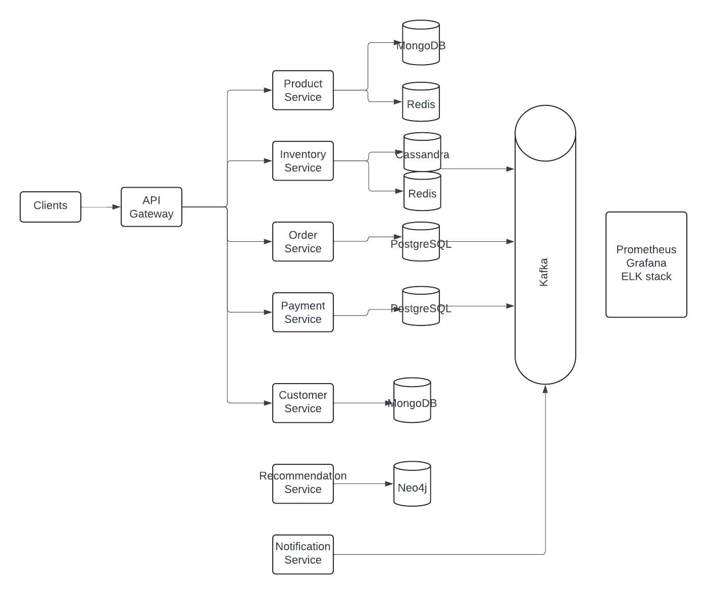

## 1. features / functionalities / system purpose + overview

#### Overview(tbf)

### Microservices Architecture

1. **Product Service**
2. **Inventory Service**
3. **Order Service**
4. **Payment Service**
5. **Customer Service**
6. **Recommendation Service**
7. **Shipping Service**
8. **Notification Service**

### Detailed Design

#### 1. Product Service

**Responsibilities:**

- Manage product details, categories, and search functionality.

**Components:**

- **Controller**: REST endpoints for managing and retrieving product information.
- **Service**: Business logic for product operations.
- **Repository**: Interface for MongoDB and Elasticsearch operations.
- **Cache**: Redis for frequently accessed product data.

**Database:**

- **MongoDB**: Store structured and flexible product details and categories.
- **Elasticsearch**: Index and search product data for fast and efficient search functionality.
- **Redis**: Cache frequently accessed product data for quick retrieval.

**Endpoints:**

- CRUD operations for products.
- Search products.

#### 2. Inventory Service

**Responsibilities:**

- Manage stock levels and availability checks.

**Components:**

- **Controller**: REST endpoints for managing inventory.
- **Service**: Business logic for inventory operations.
- **Repository**: Interface for Cassandra operations.
- **Cache**: Redis for fast access to stock data.

**Database:**

- **Cassandra**: High-throughput, scalable storage for inventory data.
- **Redis**: Cache frequently accessed stock data for real-time checks.

**Endpoints:**

- Update stock levels.
- Check stock availability.

#### 3. Order Service

**Responsibilities:**

- Handle order creation, tracking, and history.

**Components:**

- **Controller**: REST endpoints for managing orders.
- **Service**: Business logic for order operations.
- **Repository**: Interface for PostgreSQL operations.
- **Event Processor**: Listens to Kafka topics for order events.

**Database:**

- **PostgreSQL**: Store transactional order data to ensure data integrity.
- **Kafka**: Handle order events asynchronously for real-time processing.

**Endpoints:**

- Create order.
- Update order status.
- Get order history.

#### 4. Payment Service

**Responsibilities:**

- Process payments and handle transactions.

**Components:**

- **Controller**: REST endpoints for payment processing.
- **Service**: Business logic for payment operations.
- **Integration**: Interfaces for payment gateways like Stripe and PayPal.

- **PostgreSQL**: Store payment data.

**Endpoints:**

- Process payment.
- Refund payment.

#### 5. Customer Service

**Responsibilities:**

- Manage user profiles and account details.

**Components:**

- **Controller**: REST endpoints for managing customer data.
- **Service**: Business logic for customer operations.
- **Repository**: Interface for MongoDB operations.

**Database:**

- **MongoDB**: Flexible, schema-less storage for varied customer profiles and data.

**Endpoints:**

- Create/update profile.
- Retrieve customer data.

#### 6. Recommendation Service

**Responsibilities:**

- Provide personalized recommendations.

**Components:**

- **Controller**: REST endpoints for recommendations.
- **Service**: Business logic for generating recommendations.
- **Repository**: Interface for Neo4j operations.

**Database:**

- **Neo4j**: Graph-based storage for managing relationships and generating recommendations.

**Endpoints:**

- Get recommendations for a user/product.

#### 7. Shipping Service

**Responsibilities:**

- Manage shipping options, tracking, and logistics.

**Components:**

- **Controller**: REST endpoints for managing shipping.
- **Service**: Business logic for shipping operations.
- **Integration**: Interfaces for shipping providers like UPS and FedEx.

**Endpoints:**

- Calculate shipping costs.
- Track shipments.

#### 8. Notification Service

**Responsibilities:**

- Send email, SMS, and in-app notifications.

**Components:**

- **Controller**: REST endpoints for managing notifications.
- **Service**: Business logic for sending notifications.
- **Event Processor**: Listens to Kafka topics for notification events.

**Queue:**

- **Kafka**: Process asynchronous notifications to ensure timely delivery.
- **Redis**: Cache notification preferences and statuses.

**Endpoints:**

- Send notification.
- Manage notification preferences.

### Infrastructure and Deployment

**AWS Services:**

- **EC2**: Host virtual machines for microservices.
- **S3**: Store static assets like images and videos.
- **RDS**: Managed PostgreSQL instances for relational data.
- **ECS/EKS**: Run Docker containers, with Kubernetes for orchestration.
- **IAM**: Manage access to AWS resources.
- **DynamoDB**: Additional support for serverless and non-relational data storage.
- **Elasticsearch Service**: Managed Elasticsearch for search functionality.

**Containerization and Orchestration:**

- **Docker**: Containerize microservices for consistency across environments.
- **Kubernetes**: Orchestrate and manage containers for scalability and reliability.

**Monitoring and Logging:**

- **Prometheus + Grafana**: For monitoring metrics and visualizing performance.
- **ELK Stack**: Elasticsearch, Logstash, and Kibana for centralized logging and analysis.

**CI/CD:**

- **Jenkins**: Automate build, test, and deployment pipelines.
- **SonarQube**: Perform static code analysis to ensure code quality.
- **Git**: Manage source code and version control.

**Security:**

- **Spring Security**: Provide authentication and authorization.
- **OAuth2**: Secure API access.
- **SSL/TLS**: Encrypt data in transit.

**Testing:**

- **JUnit and Mockito**: Perform unit and integration testing.

**Project Management:**

- **Jira**: Track issues and manage projects.
- **Agile/Scrum**: Utilize methodologies for iterative and incremental development.

### Summary(tbf)

## 2.database schema (tables)

Sure, here’s an ultimate version of the database schema for the enterprise e-commerce platform, incorporating all the necessary databases (MongoDB, PostgreSQL, Cassandra, Elasticsearch, Neo4j, and Redis) along with their integration points.

### Product Service

#### MongoDB Schema

```json
{
  "product_id": "12345",
  "name": "Dog Food",
  "description": "High quality dog food",
  "category": "Pet Supplies",
  "price": 29.99,
  "stock": 100,
  "attributes": {
    "brand": "BestPet",
    "weight": "5kg"
  },
  "images": ["image1.jpg", "image2.jpg"]
}
```

#### Elasticsearch Schema

```json
{
  "product_id": "12345",
  "name": "Dog Food",
  "description": "High quality dog food",
  "category": "Pet Supplies",
  "price": 29.99,
  "attributes": {
    "brand": "BestPet",
    "weight": "5kg"
  }
}
```

#### Redis Schema

```plaintext
product:12345 -> {
  "product_id": "12345",
  "name": "Dog Food",
  "description": "High quality dog food",
  "category": "Pet Supplies",
  "price": 29.99,
  "stock": 100,
  "attributes": {
    "brand": "BestPet",
    "weight": "5kg"
  },
  "images": ["image1.jpg", "image2.jpg"]
}
```

### Inventory Service

#### Cassandra Schema

```cql
CREATE TABLE inventory (
    product_id UUID,
    warehouse_id UUID,
    stock INT,
    PRIMARY KEY (product_id, warehouse_id)
);
```

#### Redis Schema

```plaintext
inventory:12345 -> {
  "product_id": "12345",
  "stock": 100,
  "warehouse_id": "67890"
}
```

### Order Service

#### PostgreSQL Schema

```sql
CREATE TABLE orders (
    order_id UUID PRIMARY KEY,
    customer_id UUID,
    order_date TIMESTAMP,
    status VARCHAR(50),
    total_amount DECIMAL(10, 2)
);

CREATE TABLE order_items (
    item_id UUID PRIMARY KEY,
    order_id UUID REFERENCES orders(order_id),
    product_id UUID,
    quantity INT,
    price DECIMAL(10, 2)
);
```

### Payment Service

#### PostgreSQL Schema

```sql
CREATE TABLE payments (
    payment_id UUID PRIMARY KEY,
    order_id UUID REFERENCES orders(order_id),
    payment_date TIMESTAMP,
    amount DECIMAL(10, 2),
    status VARCHAR(50),
    payment_method VARCHAR(50)
);
```

### Customer Service

#### MongoDB Schema

```json
{
  "customer_id": "98765",
  "name": "John Doe",
  "email": "johndoe@example.com",
  "address": {
    "street": "123 Main St",
    "city": "Boston",
    "state": "MA",
    "zipcode": "02118"
  },
  "phone": "123-456-7890",
  "preferences": {
    "email_notifications": true,
    "sms_notifications": false
  }
}
```

### Recommendation Service

#### Neo4j Schema

```cypher
CREATE (:Product {product_id: '12345', name: 'Dog Food', category: 'Pet Supplies'})
CREATE (:Customer {customer_id: '98765', name: 'John Doe'})
CREATE (:Customer {customer_id: '54321', name: 'Jane Smith'})
CREATE (:Product {product_id: '67890', name: 'Cat Food', category: 'Pet Supplies'})
CREATE (:Customer {customer_id: '12345'})-[:BOUGHT]->(:Product {product_id: '67890'})
CREATE (:Customer {customer_id: '54321'})-[:BOUGHT]->(:Product {product_id: '67890'})
CREATE (:Customer {customer_id: '12345'})-[:VIEWED]->(:Product {product_id: '12345'})
```

### Shipping Service

#### PostgreSQL Schema

```sql
CREATE TABLE shipping (
    shipping_id UUID PRIMARY KEY,
    order_id UUID REFERENCES orders(order_id),
    shipping_method VARCHAR(50),
    tracking_number VARCHAR(50),
    status VARCHAR(50),
    estimated_delivery TIMESTAMP
);
```

### Notification Service(tbf)

### Summary

This hybrid database schema leverages MongoDB for flexible and dynamic data storage in the Product and Customer Services, PostgreSQL for strong transactional support in the Order, Payment, and Shipping Services, Cassandra for high-throughput and scalable storage in the Inventory Service, and Neo4j for graph-based recommendations in the Recommendation Service. Each schema is optimized for the specific requirements and data access patterns of the corresponding service, ensuring performance, scalability, and maintainability.

## 3. high level design (microservice architecture) and provide module pictures

<!--
```plaintext
                             +---------------------+
                             |       Clients       |
                             +----------+----------+
                                        |
                         +--------------v-------------+
                         |         API Gateway        |
                         +--------------+-------------+
                                        |
        +---------------+---------------+---------------+---------------+
        |               |               |               |               |
+-------v-------+ +-----v-----+ +-------v-------+ +-----v-----+ +-------v-------+
|  Product      | |  Inventory | |     Order    | |  Payment   | |  Customer     |
|  Service      | |  Service   | |    Service   | |  Service   | |   Service     |
+---------------+ +-------------+ +---------------+ +-------------+ +-------------+
|   MongoDB     | |  Cassandra  | | PostgreSQL    | | PostgreSQL  | |   MongoDB   |
| Elasticsearch | |    Redis    | |               | |             | |             |
|    Redis      | +-------------+ +---------------+ +-------------+ +-------------+
+---------------+
        +---------------+               +---------------+
        | Recommendation|               |  Notification |
        |    Service    |               |    Service    |
        +---------------+               +---------------+
        |    Neo4j      |               |   Kafka       |
        +---------------+               +---------------+

                    +---------------------+
                    |       Prometheus    |
                    |       Grafana       |
                    |       ELK Stack     |
                    +---------------------+
``` -->



## 4. rest api design (design 2 - 4 rest apis)

### 1. Product Service

**Base URL:** `/api/products`

#### a. Get Product by ID

- **Endpoint:** `GET /api/products/{productId}`
- **Description:** Retrieve a product by its ID.
- **Request Parameters:**
  - `productId`: (Path) The ID of the product to retrieve.
- **Response:**
  - **200 OK:** Returns the product details.
  - **404 Not Found:** If the product does not exist.

**Example Response:**

```json
{
  "id": "60d21b4667d0d8992e610c85",
  "name": "Product Name",
  "description": "Product Description",
  "price": 29.99,
  "category": "Electronics",
  "tags": ["tag1", "tag2"],
  "attributes": {
    "color": "black",
    "size": "M",
    "weight": 1.2
  },
  "stock": 100,
  "createdAt": "2024-06-01T12:00:00Z",
  "updatedAt": "2024-06-10T12:00:00Z"
}
```

#### b. Search Products

- **Endpoint:** `GET /api/products/search`
- **Description:** Search for products based on query parameters.
- **Request Parameters:**
  - `q`: (Query) Search query string.
  - `category`: (Query) Filter by category.
  - `priceMin`: (Query) Minimum price.
  - `priceMax`: (Query) Maximum price.
  - `sort`: (Query) Sort by field (e.g., `price`, `name`).
- **Response:**
  - **200 OK:** Returns a list of matching products.

**Example Response:**

```json
[
  {
    "id": "60d21b4667d0d8992e610c85",
    "name": "Product Name",
    "description": "Product Description",
    "price": 29.99,
    "category": "Electronics",
    "tags": ["tag1", "tag2"],
    "attributes": {
      "color": "black",
      "size": "M",
      "weight": 1.2
    },
    "stock": 100,
    "createdAt": "2024-06-01T12:00:00Z",
    "updatedAt": "2024-06-10T12:00:00Z"
  }
]
```

### 2. Order Service

**Base URL:** `/api/orders`

#### a. Create Order

- **Endpoint:** `POST /api/orders`
- **Description:** Create a new order.
- **Request Body:**
  - **Example:**

```json
{
  "userId": 1,
  "items": [
    {
      "productId": "60d21b4667d0d8992e610c85",
      "quantity": 2,
      "price": 29.99
    }
  ],
  "totalAmount": 59.98,
  "shippingAddress": {
    "street": "123 Main St",
    "city": "New York",
    "state": "NY",
    "zipCode": "10001"
  },
  "paymentMethod": "CreditCard"
}
```

- **Response:**
  - **201 Created:** Returns the created order.
  - **400 Bad Request:** If the request data is invalid.

**Example Response:**

```json
{
  "id": 12345,
  "userId": 1,
  "totalAmount": 59.98,
  "status": "PENDING",
  "createdAt": "2024-06-10T12:00:00Z",
  "updatedAt": "2024-06-10T12:00:00Z",
  "items": [
    {
      "id": 1,
      "productId": "60d21b4667d0d8992e610c85",
      "quantity": 2,
      "price": 29.99
    }
  ],
  "shippingAddress": {
    "street": "123 Main St",
    "city": "New York",
    "state": "NY",
    "zipCode": "10001"
  },
  "paymentMethod": "CreditCard"
}
```

#### b. Get Order by ID

- **Endpoint:** `GET /api/orders/{orderId}`
- **Description:** Retrieve an order by its ID.
- **Request Parameters:**
  - `orderId`: (Path) The ID of the order to retrieve.
- **Response:**
  - **200 OK:** Returns the order details.
  - **404 Not Found:** If the order does not exist.

**Example Response:**

```json
{
  "id": 12345,
  "userId": 1,
  "totalAmount": 59.98,
  "status": "PENDING",
  "createdAt": "2024-06-10T12:00:00Z",
  "updatedAt": "2024-06-10T12:00:00Z",
  "items": [
    {
      "id": 1,
      "productId": "60d21b4667d0d8992e610c85",
      "quantity": 2,
      "price": 29.99
    }
  ],
  "shippingAddress": {
    "street": "123 Main St",
    "city": "New York",
    "state": "NY",
    "zipCode": "10001"
  },
  "paymentMethod": "CreditCard"
}
```

### 3. Customer Service

**Base URL:** `/api/customers`

#### a. Create Customer

- **Endpoint:** `POST /api/customers`
- **Description:** Create a new customer profile.
- **Request Body:**
  - **Example:**

```json
{
  "username": "johndoe",
  "email": "johndoe@example.com",
  "password": "password123",
  "address": {
    "street": "123 Main St",
    "city": "New York",
    "state": "NY",
    "zipCode": "10001"
  },
  "phone": "123-456-7890"
}
```

- **Response:**
  - **201 Created:** Returns the created customer profile.
  - **400 Bad Request:** If the request data is invalid.

**Example Response:**

```json
{
  "id": "60d21b4667d0d8992e610c85",
  "username": "johndoe",
  "email": "johndoe@example.com",
  "address": {
    "street": "123 Main St",
    "city": "New York",
    "state": "NY",
    "zipCode": "10001"
  },
  "phone": "123-456-7890",
  "createdAt": "2024-06-10T12:00:00Z",
  "updatedAt": "2024-06-10T12:00:00Z"
}
```

#### b. Get Customer by ID

- **Endpoint:** `GET /api/customers/{customerId}`
- **Description:** Retrieve a customer profile by its ID.
- **Request Parameters:**
  - `customerId`: (Path) The ID of the customer to retrieve.
- **Response:**
  - **200 OK:** Returns the customer profile.
  - **404 Not Found:** If the customer does not exist.

**Example Response:**

```json
{
  "id": "60d21b4667d0d8992e610c85",
  "username": "johndoe",
  "email": "johndoe@example.com",
  "address": {
    "street": "123 Main St",
    "city": "New York",
    "state": "NY",
    "zipCode": "10001"
  },
  "phone": "123-456-7890",
  "createdAt": "2024-06-10T12:00:00Z",
  "updatedAt": "2024-06-10T12:00:00Z"
}
```

### 4. Inventory Service

**Base URL:** `/api/inventory`

#### a. Update Stock Level

- **Endpoint:** `PUT /api/inventory/{productId}`
- **Description:** Update the stock level for a product.
- **Request Parameters:**
  - `productId`: (Path) The ID of the product to update stock level.
- **Request Body:**
  - **Example:**

```json
{
  "stockLevel": 150,
  "warehouseId": "60d21b4667d0d8992e610c86"
}
```

- **Response:**
  - **200 OK:** Returns the updated stock information.
  - **400 Bad Request:** If the request data is invalid.
  - **404 Not Found:** If the product does not exist.

**Example Response:**

```json
{
  "productId": "60d21b4667d0d8992e610c85",
  "stockLevel": 150,
  "warehouseId": "60d21b4667d0d8992e610c86",
  "updatedAt": "2024-06"
}
```

## 5. Data flow, prepare 2 - 3 data flow diagram example: when user client some buttons to upload some files, what happens next, how does

### 1. placing an order in an e-commerce platform, including Redis integration for caching frequently accessed product data:

```
+---------------------------------------------------------+
|                    User Interface (UI)                  |
+-------------------------+-------------------------------+
|  Functions:                                             |
|  - Displays order form                                  |
|  - Collects user inputs (items, quantities, etc.)       |
|  - Sends order request to Frontend Service              |
+-------------------------+-------------------------------+
                          |
                          v
+-------------------------+-------------------------------+
|                   Frontend Service                      |
+-------------------------+-------------------------------+
|  Functions:                                             |
|  - Receives order request from UI                       |
|  - Validates user inputs                                |
|  - Formats order request                                |
|  - Calls Order Service to process order                 |
|  - Calls Payment Service to process payment             |
+-------------------------+-------------------------------+
                          |
             +------------+---------------------------------------------------------------------+
             |                                                                                  |
             v                                                                                  v
+-------------------------+-----------------------+             +-------------------------+---------------------------+
|                   Order Service                 |             |                 Payment Service                     |
+-------------------------+-----------------------+             +-------------------------+---------------------------+
|  Functions:                                     |             |   Functions:                                        |
|  - Receives order request                       |             |   - Receives payment details                        |
|  - Validates and processes order                | <---------  |   - Processes payment securely                      |
|  - Stores order details in PostgreSQL Database  |             |   - Updates payment status in PostgreSQL Database   |
|                                                 |             |                                                     |
+-------------------------+-----------------------+             +-------------------------+---------------------------+
                          |
                          v
+-------------------------+-------------------------------+
|                  PostgreSQL Database                    |
+-------------------------+-------------------------------+
|  Functions:                                             |
|  - Stores order details (order ID, items, quantities)   |
+-------------------------+-------------------------------+

```

### Explanation:

1. **User Interface (UI):**

   - User interacts with the UI to place an order by entering items and quantities.

2. **Frontend Service:**

   - Receives order details from the UI.
   - Validates user inputs.
   - Formats the order request for processing.
   - Calls the Order Service and Payment Service.

3. **Order Service:**
   - Receives order request from the Frontend Service.
   - Validates and processes the order, including checking stock availability.
   - Retrieves product details from Redis cache for faster access if available.
   - Stores order details in the PostgreSQL Database.
4. **Payment Service:**

   - Receives payment details from the Frontend Service.
   - Processes the payment securely.
   - Updates the order status in the Transactional Database based on payment success or failure.

5. **PostgreSQL Database:**

   - Stores detailed order information received from the Order Service.

6. **Redis Cache:**
   - Stores frequently accessed product data fetched by the Order Service.
   - Enhances performance by reducing database queries for product information.

- **If Payment Fails:**
  - Payment Service updates order status to "Payment Failed" in the Payment Database.
  - Payment Service sends failure response to Frontend Service.
  - Frontend Service notifies the user about the payment failure.
  - Order remains in pending state in Order Service until resolved.

### 2. Product Search and Display

```
+--------------------------------------------------------+
|                  User Interface (UI)                   |
+-------------------------+------------------------------+
| Functions:                                             |
| - Displays search interface                            |
| - Collects search criteria (keywords, filters)         |
| - Sends search request to Frontend Service             |
+-------------------------+------------------------------+
                          |
                          v
+-------------------------+------------------------------+
|                  Frontend Service                      |
+-------------------------+------------------------------+
| Functions:                                             |
| - Receives search request from UI                      |
| - Validates search criteria                            |
| - Formats search request                               |
| - Calls Product Service to fetch products              |
+-------------------------+------------------------------+
                          |
                          v
+-------------------------+------------------------------+
|                   Product Service                      |
+-------------------------+------------------------------+
| Functions:                                             |
| - Receives search request                              |
| - Queries Elasticsearch or MongoDB for products        |
| - Caches results in Redis for future requests          |
| - Returns matching products                            |
+-------------------------+------------------------------+
                          |
                          v
+-------------------------+------------------------------+
|               Elasticsearch or MongoDB                 |
+-------------------------+------------------------------+
| Functions:                                             |
| - Stores and retrieves product data                    |
| - Provides fast access to product information          |
+-------------------------+------------------------------+
                          |
                          v
+-------------------------+------------------------------+
|                    Cache (Redis)                       |
+-------------------------+------------------------------+
| Functions:                                             |
| - Caches frequently accessed product data              |
+-------------------------+------------------------------+
```

### Explanation:

1. **User Interface (UI)**:

   - Displays the search interface where users input search criteria like keywords, filters.
   - Collects user inputs and sends a search request to the Frontend Service.

2. **Frontend Service**:

   - Receives the search request from the UI.
   - Validates and formats the search criteria for processing.
   - Initiates a call to the Product Service to fetch products based on the search criteria.

3. **Product Service**:

   - Receives the search request from the Frontend Service.
   - Queries MongoDB for products matching the search criteria.
   - Optionally caches frequently accessed product data in Redis to optimize future requests.
   - Prepares the data for indexing in Elasticsearch.

4. **MongoDB**:

   - Acts as the primary database for storing and managing product data.
   - Stores detailed product information including attributes, categories, and images in flexible document structures.

5. **Cache (Redis)**:

   - Functions as a caching layer to store frequently accessed product data.
   - Helps reduce query load on MongoDB by serving cached data for repetitive requests.

6. **Elasticsearch**:
   - **Indexing**: Elasticsearch indexes data received from the Product Service. This involves transforming MongoDB documents into flat, denormalized JSON documents optimized for search.
   - **Search Operations**: Provides fast, real-time search capabilities. Users’ search queries are processed against the indexed data, enabling quick retrieval of relevant products.
   - **Aggregations**: Supports aggregations to summarize and analyze product data dynamically, such as by category, price range, or popularity.
   - **Scalability**: Elasticsearch is horizontally scalable, allowing it to handle large volumes of data and high query loads efficiently.
   - **Integration**: Product Service synchronizes updates to Elasticsearch in near real-time using mechanisms like bulk indexing, ensuring that search results reflect the most current product data.

### Benefits of Elasticsearch Integration:

- **Fast Search**: Enables users to quickly find products based on search criteria.
- **Scalability**: Scales horizontally to accommodate growing data and user traffic.
- **Flexible Aggregations**: Supports dynamic aggregations for detailed analytics and reporting.
- **Real-time Updates**: Near real-time synchronization with MongoDB ensures up-to-date search results.

### 3.Customer Registration(tbf)

```
+---------------------------------------------------------+
|                    User Interface (UI)                  |
+-------------------------+-------------------------------+
|  Functions:                                             |
|  - Displays registration form                           |
|  - Collects user inputs (name, email, password, etc.)   |
|  - Sends registration request to Frontend Service       |
+-------------------------+-------------------------------+
                          |
                          v
+-------------------------+-------------------------------+
|                   Frontend Service                      |
+-------------------------+-------------------------------+
|  Functions:                                             |
|  - Receives registration request from UI                |
|  - Validates user inputs                                |
|  - Formats registration request                         |
|  - Calls Customer Service to create user account        |
+-------------------------+-------------------------------+
                          |
                          v
+-------------------------+-------------------------------+
|                   Customer Service                      |
+-------------------------+-------------------------------+
|  Functions:                                             |
|  - Receives registration request                        |
|  - Validates and processes user data                    |
|  - Stores user details in MongoDB                       |
|  - Returns registration confirmation                    |
+-------------------------+-------------------------------+
                          |
                          v
+-------------------------+-------------------------------+
|                      MongoDB                            |
+-------------------------+-------------------------------+
|  Functions:                                             |
|  - Stores user details (name, email, password, etc.)    |
+-------------------------+-------------------------------+

```

### 4.Sending Notifications(tbf)

```
+--------------------------------------------------------+
|                   Order Service                        |
+-------------------------+------------------------------+
|  Functions:                                            |
|  - Sends order creation event to Kafka                 |
+-------------------------+------------------------------+
                          |
                          v
+-------------------------+-------------------------------+
|                      Kafka                              |
+-------------------------+-------------------------------+
|  Functions:                                             |
|  - Event-driven architecture for asynchronous processing|
+-------------------------+-------------------------------+
                          |
                          v
+-------------------------+------------------------------+
|                Notification Service                    |
+-------------------------+------------------------------+
|  Functions:                                            |
|  - Listens to Kafka topics for order events            |
|  - Sends notifications via email, SMS, or in-app       |
|  - Manages notification preferences and statuses       |
+-------------------------+------------------------------+
                          |
                          v
+-------------------------+------------------------------+
|                       Redis                            |
+-------------------------+------------------------------+
|  Functions:                                            |
|  - Caches notification preferences and statuses        |
+-------------------------+------------------------------+

```

## 6. Message queue

### Message Queue Design using Kafka

#### Architecture Overview

1. **Kafka Cluster**

   - A cluster consisting of multiple Kafka brokers responsible for storing and managing topics.
   - Provides fault tolerance, scalability, and high availability.

2. **Producers**

   - Services or components that produce messages (events) to Kafka topics.
   - Examples: Order Service, Payment Service, Inventory Service.

3. **Consumers**

   - Services or components that consume messages from Kafka topics and process them asynchronously.
   - Examples: Payment Service, Order Service, Notification Service.

4. **ZooKeeper**
   - Coordinates and manages the Kafka brokers, ensuring they work together effectively.

#### Components

1. **Kafka Brokers**

   - Responsible for receiving, storing, and serving messages from producers to consumers.
   - Maintain partitions for topics and handle message replication and distribution.

2. **Producers**

   - **Order Service Producer:** Generates order events (e.g., order placed, order canceled) and publishes them to the `order_events` topic.
   - **Payment Service Producer:** Produces payment events (e.g., payment processed, refund initiated) to the `payment_events` topic.
   - **Inventory Service Producer:** Publishes inventory events (e.g., stock updated) to the `inventory_events` topic.

3. **Consumers**
   - **Payment Service Consumer:** Subscribes to the `order_events` topic, processes payment-related events, and publishes payment status updates to the `payment_events` topic.
   - **Order Service Consumer:** Listens to the `payment_events` topic, updates order status based on payment confirmation, and sends notifications to customers via the `notification_events` topic.
   - **Notification Service Consumer:** Consumes notification events from the `notification_events` topic and sends notifications (e.g., emails, SMS) to customers.

#### Topics

1. **order_events**

   - Topic for handling order-related events.
   - Messages include events such as order placed, order canceled, order updated.

2. **payment_events**

   - Topic for managing payment-related events.
   - Messages include events like payment processed, refund initiated, payment failed.

3. **inventory_events**

   - Topic for inventory-related events.
   - Messages include events such as stock updated, item availability changed.

4. **notification_events**
   - Topic for handling notification-related events.
   - Messages include events like order confirmation sent, shipment status updated.

#### Flow

##### 1. Order Placement Flow

- **Order Service Producer**

  - Generates an order event (e.g., order placed) and sends it to the `order_events` topic.

- **Payment Service Consumer**

  - Subscribes to the `order_events` topic.
  - Processes payment for the order.
  - Produces a payment event (e.g., payment processed) to the `payment_events` topic.

- **Order Service Consumer**

  - Listens to the `payment_events` topic.
  - Updates order status based on payment confirmation.
  - Publishes a notification event (e.g., order confirmed) to the `notification_events` topic.

- **Notification Service Consumer**
  - Consumes notification events from the `notification_events` topic.
  - Sends notifications (e.g., order confirmation) to customers.

##### 2. Payment Refund Flow

- **Payment Service Producer**

  - Initiates a refund for a payment and publishes a refund event to the `payment_events` topic.

- **Order Service Consumer**
  - Listens to the `payment_events` topic.
  - Updates order status based on the refund event.

#### Benefits of Using Kafka

- **Scalability**: Kafka scales horizontally by adding more brokers to the cluster.
- **Reliability**: Ensures fault tolerance with data replication and persistence.
- **Real-time Processing**: Enables real-time event processing with low latency.
- **Decoupling**: Services are decoupled, allowing asynchronous communication and independence.
- **Integration Flexibility**: Supports integration with various systems and services using its robust APIs and connectors.

## 7. biggest challenge(technical challenge)

**Answer:**

One of the biggest technical challenges I faced was during a major sales event. We experienced a significant traffic surge that caused one of our critical services to fail. This failure had a cascading effect, impacting other related services and leading to overall platform instability.

**_short version:_**

```
During a peak traffic event, one of our critical services encountered a failure, leading to a cascade effect on related services and impacting overall platform stability.

**How I handled it:**

I immediately scaled the service horizontally, implemented auto-scaling, and used a circuit breaker pattern to manage traffic. We also leveraged caching, rate limiting, and message queues to alleviate the immediate load and stabilize the system.

**Improvements made:**

Post-incident, we focused on enhancing fault tolerance, refining auto-scaling policies, and conducting thorough load testing. We also strengthened monitoring, resource allocation strategies, and disaster recovery plans to ensure better resilience in high-demand scenarios.
```

**What I did when the challenge happened:**

1. **Scaled Services Horizontally:** We quickly added more instances of the overwhelmed service behind a load balancer to distribute the traffic more evenly.
2. **Implemented Auto-Scaling:** We set up auto-scaling policies to dynamically increase the number of instances based on real-time demand.
3. **Activated Circuit Breaker Pattern:** To prevent continuous requests from hitting the failing service, we implemented a circuit breaker. This helped reroute traffic to fallback mechanisms, allowing the service time to recover.
4. **Leveraged Caching:** We used Redis to cache frequently accessed data, reducing the load on the service.
5. **Rate Limiting:** We applied rate limiting to control the number of requests per user, preventing a flood of requests from overwhelming the service.
6. **Utilized Message Queues:** By offloading non-critical tasks to Kafka message queues, we managed asynchronous tasks more effectively, reducing immediate load on the service.
7. **Enhanced Monitoring:** We closely monitored the situation using Prometheus and Grafana, setting up alerts to identify and address potential issues promptly.

**How I improved the system after the event:**

1. **Resilience Enhancements:** We implemented additional fault tolerance and resilience measures, such as service isolation and fallback strategies, to prevent cascading failures.
2. **Improved Auto-Scaling Policies:** We refined our auto-scaling policies to be more responsive to traffic patterns, ensuring better handling of future surges.
3. **Load Testing:** We conducted thorough load testing to identify and address potential bottlenecks before they became critical issues.
4. **Better Resource Allocation:** We optimized resource allocation based on historical traffic data, ensuring critical services had sufficient resources during peak times.
5. **Enhanced Logging and Monitoring:** We improved our logging and monitoring setup to gain deeper insights into service performance and potential failure points.
6. **Disaster Recovery Planning:** We developed more robust disaster recovery plans to ensure quick recovery in case of future incidents.
7. **Continuous Improvement:** We established a feedback loop for continuous improvement, regularly reviewing and updating our systems based on lessons learned from the event.

## 8. aws

1. **Amazon EC2 (Elastic Compute Cloud)**:
   Used for hosting virtual servers to run applications and manage computing capacity dynamically.

2. **Amazon S3 (Simple Storage Service)**: Provides scalable object storage for storing and retrieving large amounts of data, such as product images, videos, and backups.

3. **Amazon RDS (Relational Database Service)**: Managed relational database service for PostgreSQL, MySQL, MariaDB, Oracle, and SQL Server, used for transactional data storage.

4. **Amazon DynamoDB**: Fully managed NoSQL database service for applications that need seamless scalability and performance at any scale.

5. **Amazon ECS (Elastic Container Service)** or **Amazon EKS (Elastic Kubernetes Service)**: Services for deploying, managing, and scaling containerized applications using Docker containers and Kubernetes.

6. **Amazon ElastiCache**: In-memory caching service for accelerating the performance of web applications by reducing latency and load on databases.

7. **Amazon Elasticsearch Service**: Managed service for deploying, operating, and scaling Elasticsearch clusters for real-time search and analytics.

8. **Amazon Kinesis**: Service for real-time data streaming and analytics, used for processing and analyzing real-time data streams from applications.

9. **Amazon SQS (Simple Queue Service)** or **Amazon SNS (Simple Notification Service)**: Messaging and notification services used for decoupling application components and managing asynchronous communication.

10. **AWS Lambda**: Serverless compute service for running code in response to events, handling background tasks, and executing microservices architecture.

11. **Amazon API Gateway**: Fully managed service for creating, deploying, and managing secure APIs at any scale, providing access to backend services hosted on AWS or elsewhere.

12. **AWS CloudWatch**: Monitoring and observability service for monitoring performance, operational health, and logging of applications and AWS resources.

13. **AWS Identity and Access Management (IAM)**: Service for managing access to AWS services and resources securely.

14. **AWS CloudFormation**: Infrastructure as Code (IaC) service for provisioning and managing AWS resources using templates.

## 9.Prepare stories based on your resume: example, where did you use multithreading in your last project? Where did you use builder design patterns in your last project?

1. **Multithreading Story:**
   In our Chewy-like e-commerce system, multithreading played a crucial role in optimizing product catalog updates. Specifically, we utilized multithreading to parallelize the process of importing and updating product information from suppliers' feeds. Each thread was responsible for processing a subset of products concurrently, leveraging Java's `ExecutorService` and `Thread` classes. This approach not only accelerated the synchronization of product data but also ensured that our catalog remained up-to-date with the latest inventory and pricing information. By effectively managing concurrency, we enhanced system responsiveness and scalability, meeting the demands of high-traffic periods without compromising on data accuracy.

2. **Builder Design Pattern Story:**
   Within our Chewy-inspired e-commerce platform, we implemented the Builder design pattern to streamline the creation of complex product configurations. For instance, when introducing new product categories or customizing product bundles, we employed a ProductBuilder class. This builder encapsulated the steps for assembling product attributes, options, and pricing structures dynamically. By abstracting the construction process, we achieved greater flexibility in configuring product offerings while maintaining code clarity and reusability. This approach proved invaluable in adapting to market trends and customer preferences swiftly, empowering our platform to efficiently handle diverse product configurations and variations.

## 10. Come up team size(if you are the leader, how many people do you need and their responsibilities)

**Team Composition (10 members):\***

- **_Team Lead (1):_** Oversee project development, coordinate between teams, ensure project milestones are met.
- **_Backend Developers (4):_** Develop and maintain microservices, implement APIs, integrate with databases.
- **_Frontend Developers (2):_** Develop and maintain the Angular-based web application, implement UI/UX features.
- **_DevOps Engineers (2):_** Manage CI/CD pipelines, infrastructure setup, and maintenance.
- **_QA Engineers (1):_** Conduct testing (unit, integration, load testing), ensure code quality and reliability.

## 11. Design a Jenkins pipeline flow to (AWS / local) depends on your resume project(if you want to keep AWS)

#### Pipeline Overview:

This Jenkins pipeline automates the build, test, and deployment process for this e-commerce application on AWS. It includes stages for building Docker images, running tests, and deploying to AWS services like ECS (Elastic Container Service) and S3 (Simple Storage Service).

**_Short version:_**

```
Pipeline Steps:

Clone Repository:
Pull the latest code from the Git repository.

Build:
Compile the code and build Docker images for each microservice.

Test:
Run unit tests and integration tests using JUnit and Mockito.
Perform static code analysis using SonarQube.

Deploy to AWS:
Push Docker images to AWS ECR.
Update Kubernetes deployments on AWS EKS.
Use Helm charts for managing Kubernetes resources.

Monitor:
Use Prometheus and Grafana for monitoring.
Use the ELK stack for centralized logging and analysis.
```

```groovy
pipeline {
    agent any

    environment {
        AWS_DEFAULT_REGION = 'your-aws-region'
        AWS_ACCOUNT_ID = 'your-aws-account-id'
        AWS_ACCESS_KEY_ID = credentials('aws-access-key-id')
        AWS_SECRET_ACCESS_KEY = credentials('aws-secret-access-key')
        DOCKER_REGISTRY = 'your-docker-registry-url'
        ECS_CLUSTER = 'your-ecs-cluster-name'
        S3_BUCKET = 'your-s3-bucket-name'
    }

    stages {
        stage('Build') {
            steps {
                script {
                    // Example: Build Docker image
                    docker.build("your-image-name")
                }
            }
        }

        stage('Test') {
            steps {
                // Example: Run tests using Maven or Gradle
                sh 'mvn test'
            }
        }

        stage('Deploy to ECS') {
            steps {
                script {
                    // Example: Push Docker image to registry
                    docker.withRegistry("${DOCKER_REGISTRY}", 'docker-credentials') {
                        docker.image("your-image-name").push("${env.BUILD_NUMBER}")
                    }

                    // Example: Deploy to ECS
                    sh "ecs-cli compose --project-name your-project-name service up --create-log-groups --cluster ${ECS_CLUSTER}"
                }
            }
        }

        stage('Backup to S3') {
            steps {
                script {
                    // Example: Package artifacts and backup to S3
                    sh "zip -r artifacts.zip ."
                    s3Upload(bucket: "${S3_BUCKET}", file: 'artifacts.zip')
                }
            }
        }

        stage('Cleanup') {
            steps {
                // Example: Clean up temporary artifacts
                sh 'rm -rf artifacts.zip'
            }
        }
    }

    post {
        success {
            echo 'Deployment successful!'
        }
        failure {
            echo 'Deployment failed!'
        }
    }
}
```

### Explanation:

- **Agent:** Specifies any available Jenkins agent to execute the pipeline stages.
- **Environment:** Defines environment variables including AWS credentials, Docker registry URL, ECS cluster name, and S3 bucket name.
- **Stages:**
  - **Build:** Builds the Docker image for your application.
  - **Test:** Runs automated tests (replace `mvn test` with your actual test commands).
  - **Deploy to ECS:** Pushes the Docker image to the registry and deploys it to ECS using `ecs-cli`.
  - **Backup to S3:** Packages artifacts (if any) and uploads them to an S3 bucket for backup or distribution.
  - **Cleanup:** Cleans up temporary artifacts after deployment.
- **Post-build Actions:** Executes actions based on pipeline outcome (success or failure).

### Notes:

- **Credentials:** Use Jenkins credentials store for sensitive data like AWS access keys and Docker registry credentials.
- **Customization:** Replace placeholders (`your-aws-region`, `your-aws-account-id`, etc.) with your actual AWS configuration.
- **Integration:** Integrate additional stages or steps as per your project's requirements (e.g., database migrations, CDN cache invalidation).

## 12. monitor in project

**_Short Answer:_**

```
Prometheus: For system performance monitoring and alerting.
Grafana: For data visualization and dashboard creation.
ELK Stack: For centralized logging, log management, and analysis.

```

1. Monitoring Objectives:
   - Performance Monitoring: Track system performance metrics such as response times, throughput, and resource utilization (CPU, memory, disk).
   - Availability Monitoring: Ensure all services are up and running, detect and alert on service failures or downtime.
   - Error Monitoring: Monitor logs and errors to identify issues and anomalies in real-time.
   - Security Monitoring: Monitor for security events, unauthorized access attempts, and anomalies in user behavior.
   - Business Metrics: Monitor business-specific metrics such as orders processed per hour, revenue generated, etc.
2. Tools and Technologies:
   - Logging and Log Management: Tools like ELK Stack (Elasticsearch, Logstash, Kibana), or AWS CloudWatch Logs for centralized logging and log analysis.
   - Metrics Monitoring: Use Prometheus and Grafana for metrics collection, visualization, and alerting.
   - Application Performance Monitoring (APM): Tools like New Relic, Datadog, or AWS X-Ray for tracing and monitoring application performance.
   - Infrastructure Monitoring: AWS CloudWatch for monitoring AWS services and infrastructure metrics.
   - Security Monitoring: Implement tools like AWS GuardDuty for threat detection, and WAF (Web Application Firewall) for protecting against common web exploits.

## 13. daily user / TPS / QPS

- Daily Active Users (DAU): Ranging from tens of thousands to hundreds of thousands
- Transactions Per Second (TPS): Thousands level
- Queries Per Second (QPS): Thousands level

## 14. frontend story

```
In my current role, I was tasked with revamping the shopping cart page for our e-commerce platform using Angular. It was a pivotal part of the user experience, so we wanted to make it really seamless.

We designed the cart page as a dynamic Angular component. Users could see all their selected items, adjust quantities on the fly, and get instant updates on prices without having to refresh the page. It made shopping easier and more intuitive.

One of the cool things we focused on was making sure the page looked great and worked smoothly on any device—whether you were on a desktop or shopping from your phone. That responsive design was crucial for our users.

Using Angular's HttpClient module, we hooked everything up to our backend systems flawlessly. This meant we could fetch and update cart data quickly and accurately, which was a big win for user experience.

Performance was also a big deal for us. We used techniques like lazy loading to speed up how the page loaded, minimized how many times the page had to talk to the server, and made sure we cached data smartly to keep things running smoothly.

Overall, our new Angular-powered shopping cart page really made a difference. It helped boost user engagement and cut down on people leaving their carts before checking out. Plus, it just made shopping more enjoyable for our customers, which is always the goal.

So, that project really highlighted how Angular's features let us build a user-friendly, responsive interface that met both our users' needs and our business goals.
```

**Designing the Shopping Cart Page with Angular**

As part of enhancing the shopping experience on our e-commerce platform similar to Chewy, I led the design and development of the shopping cart page using Angular.

**Component Overview:**

The shopping cart page was implemented as an Angular component. It featured:

- **Product Listing:** Displayed items added to the cart with details like product image, name, quantity, and price.
- **Quantity Control:** Users could adjust product quantities directly from the cart page.
- **Price Calculation:** Automatically calculated and displayed the subtotal, taxes, and total price based on the items in the cart.
- **Checkout Process:** Integrated with Angular Router to smoothly navigate users to the checkout process.

**Key Features:**

1. **Responsive Design:** Ensured the shopping cart was fully responsive, adapting seamlessly to various screen sizes and devices.

2. **Real-time Updates:** Utilized Angular's data binding and services to reflect real-time changes in cart items, quantities, and prices without requiring a page reload.

3. **API Integration:** Connected to backend services via Angular's HttpClient module to fetch and update cart data, ensuring accuracy and consistency.

4. **User Interaction:** Implemented intuitive UI controls for users to add, remove, or adjust quantities of items in the cart, enhancing usability.

5. **Performance Optimization:** Optimized the Angular application for performance, including lazy loading modules, minimizing HTTP requests, and caching strategies to enhance load times.

**Impact:**

The Angular-powered shopping cart page resulted in improved user engagement and reduced cart abandonment rates. Its responsive design and seamless integration with backend services provided a smooth shopping experience, contributing to increased conversion rates and customer satisfaction.
